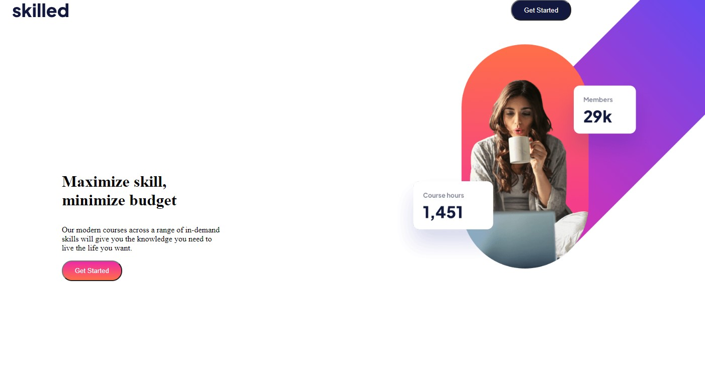

# Frontend Mentor - Skilled e-learning landing page solution

This is a solution to the [Skilled e-learning landing page challenge on Frontend Mentor](https://www.frontendmentor.io/challenges/skilled-elearning-landing-page-S1ObDrZ8q). Frontend Mentor challenges help you improve your coding skills by building realistic projects.

## Table of contents

- [Overview](#overview)
  - [The challenge](#the-challenge)
  - [Screenshot](#screenshot)
  - [Links](#links)
  - [Built with](#built-with)
  - [What I learned](#what-i-learned)
- [Author](#author)

**Note: Delete this note and update the table of contents based on what sections you keep.**

## Overview

### The challenge

Users should be able to:

- View the optimal layout depending on their device's screen size
- See hover states for interactive elements

### Screenshot

### Links

- Solution URL: [GitHub Code Repository](https://github.com/DarkPhoenixNinja92/Skilled-elearning-Landing-Page)
- Live Site URL: [Live Site](https://darkphoenixninja92.github.io/Skilled-elearning-Landing-Page/)

### Built with

- Semantic HTML5 markup
- CSS custom properties
- Flexbox
- CSS Grid
- Mobile-first workflow

### What I learned

This project was a useful bit of practice to get my head around combining flexbox and grid in order to create more flexible page layouts (although I still have to figure out why certain pieces of layout like the position of the header button and my footer's width seem to change between page reloads).

## Author

- Website - [Shaun Pour](https://www.shaunpourdev.com)
- Frontend Mentor - [@DarkPhoenixNinja92](https://www.frontendmentor.io/profile/DarkPhoenixNinja92)
